## Hi! 👋 My name is Scott.

I'm a **game**, **web**, and **open source tool** developer.

I've released **150+ open source projects** on [GitHub](https://github.com/neogeek), I've won awards for 🏆 Best in VR and 🏆 Best of Accessibility at the 2020 [MIT Reality Hack](https://www.mitrealityhack.com), I run the [Purple Monkey Game Jam](https://purplemonkeygamejam.com/), given talks at [Boston Game Dev](https://www.meetup.com/bostongamedev/) meetups, and I just released my first game for mobile platforms called 🃏 [Flip Jacks](https://flipjacksgame.com).

## [Flip Jacks](https://flipjacksgame.com/)

Flip Jacks is a physics-based poker game in AR. Each game takes only 30 seconds. Can you flip your way to a winning hand?

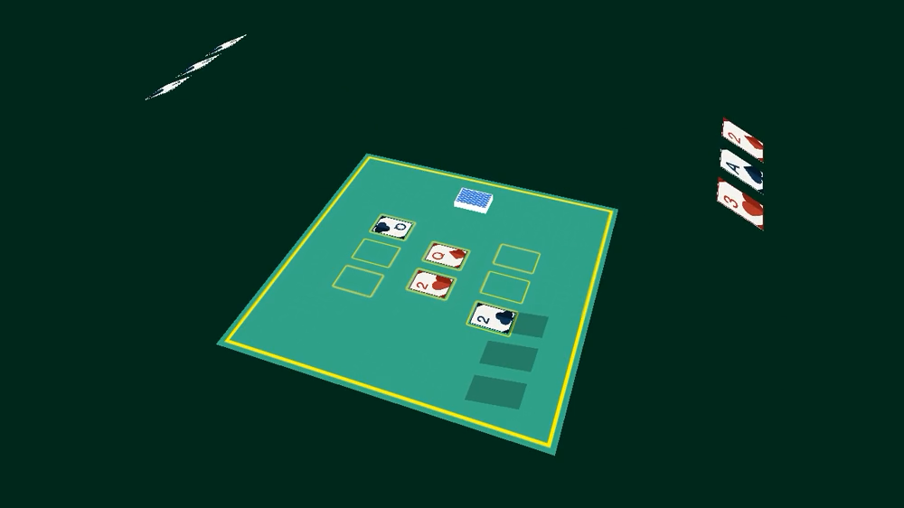

- [Google Play](https://play.google.com/store/apps/details?id=com.thelast90percent.flipjacks)
- [iOS App Store](https://apps.apple.com/app/flip-jacks/id6499108375)
- [Play Game Online](https://scottdoxey.itch.io/flip-jacks/)
- [Learn More](https://flipjacksgame.com/)

## [onlybuild](https://github.com/neogeek/onlybuild)

A zero-config cli for building static websites.

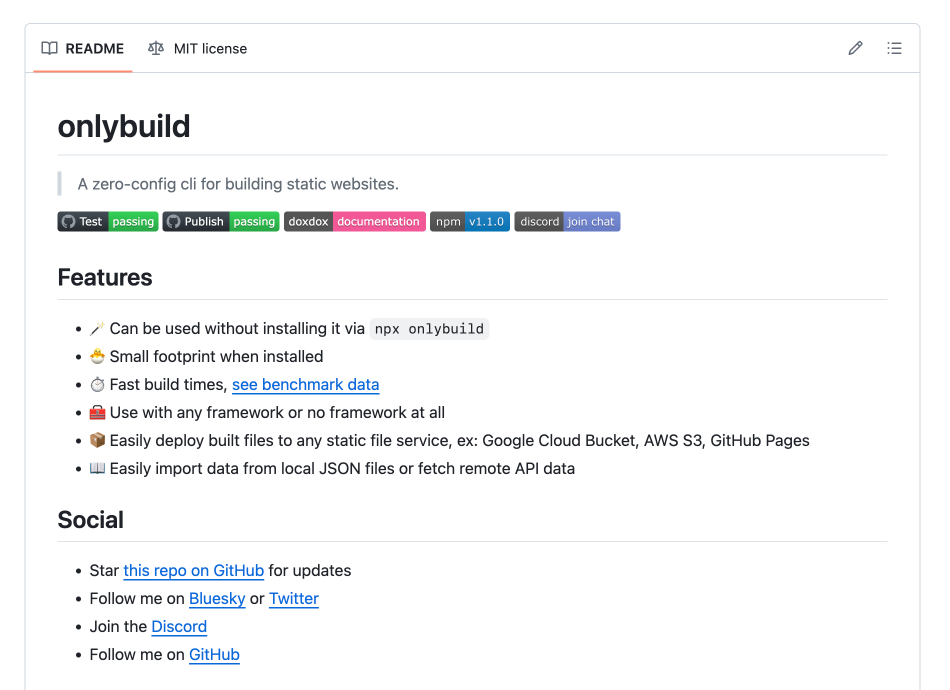

- [GitHub](https://github.com/neogeek/onlybuild/)

## [Rhythm Game Utilities](https://github.com/neogeek/rhythm-game-utilities)

This library is a collection of utilities for creating rhythm games like Tap Tap Revenge, Guitar Hero, and Rock Band. It is meant to be used within any game engine that supports loading C++ libraries, such as Unity, Unreal, and Godot.

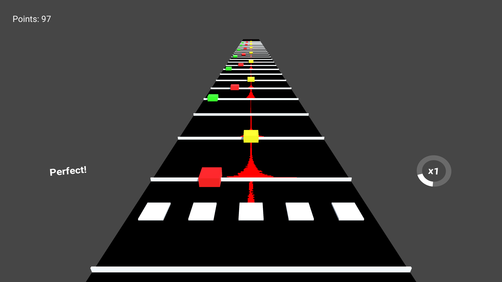

- [GitHub](https://github.com/neogeek/rhythm-game-utilities/)
- [Case Study](/case-study/rhythm-game-prototype/)

## [Handcrank Engine](https://github.com/HandcrankEngine/HandcrankEngine/)

Handcrank is a game engine built in C++ on top of SDL with a focus on a simple, Unity GameObject-like object class structure inheritance. Handcrank is currently in active development.

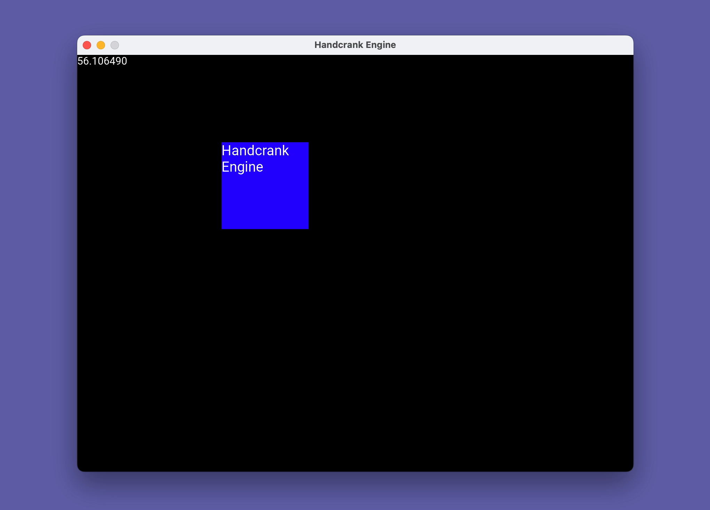

- [GitHub](https://github.com/HandcrankEngine/HandcrankEngine/)

## [QR Code Generator](https://qr-code-generator-eight-drab.vercel.app/)

Frustrated with the quality of existing free (and paid) QR code generators, I built this tool to be simple, free, and without data analytics.

- [Try it Online](https://qr-code-generator-eight-drab.vercel.app/)
- [GitHub](https://github.com/neogeek/qr-code-generator/)

## [Secret Scene](undefined)

An OBS automatic scene switcher for sensitive applications. Works on the same machine OBS is running on or another computer on the same network.

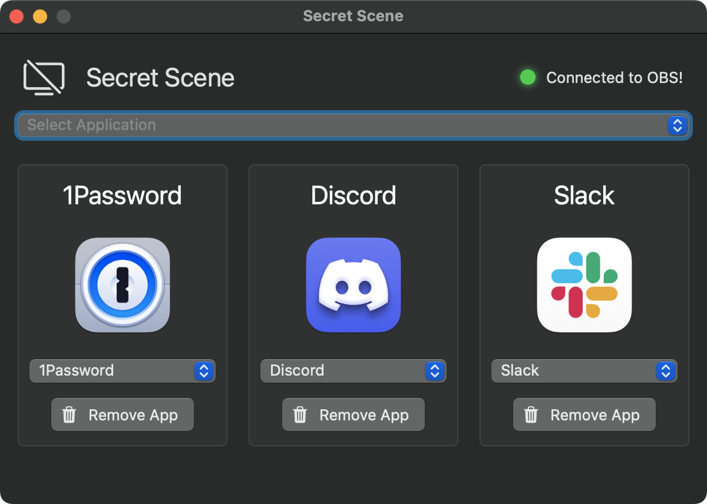

- Coming Soon

## [generate-local-changelog](https://github.com/neogeek/generate-local-changelog)

This homebrew distributed CLI generates local CHANGELOG.md files without access to a repo's remote via an API. The latest version has been ported to Rust for improved performance.

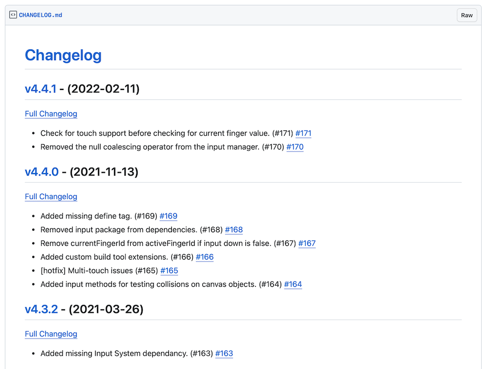

- [GitHub](https://github.com/neogeek/generate-local-changelog)

## [CandyCoded](https://github.com/CandyCoded/CandyCoded)

CandyCoded is a collection of useful components and extensions for building in Unity. Whether you are building a quick prototype or a production-ready experience, CandyCoded will help you get there.

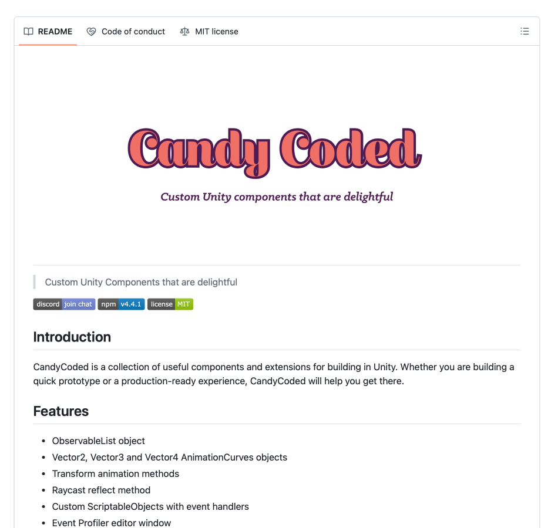

- [GitHub](https://github.com/CandyCoded/CandyCoded)

## [doxdox](https://doxdox.org/)

doxdox is a tool for auto-generating documentation using JSDoc headers locally or via a hosted platform pointed at a public GitHub repo.

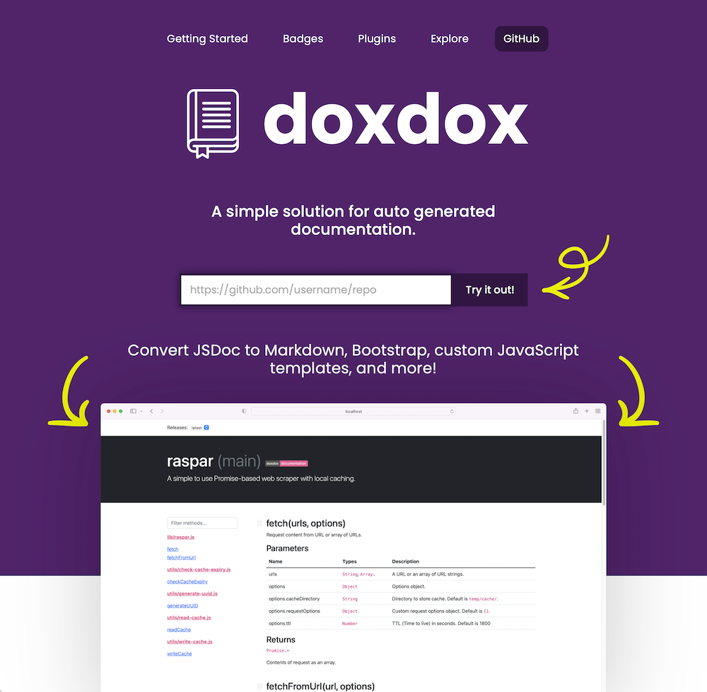

- [Try It Online](https://doxdox.org/)
- [GitHub](https://github.com/docsbydoxdox/doxdox)

## [Match Attack](https://scottdoxey.itch.io/match-attack)

Match Attack is a memory game with a twist. Collect tiles that can then be used against an evil clown hell-bent on killing you. Made at the <a href="https://globalgamejam.org/">Global Game Jam</a> in January 2021

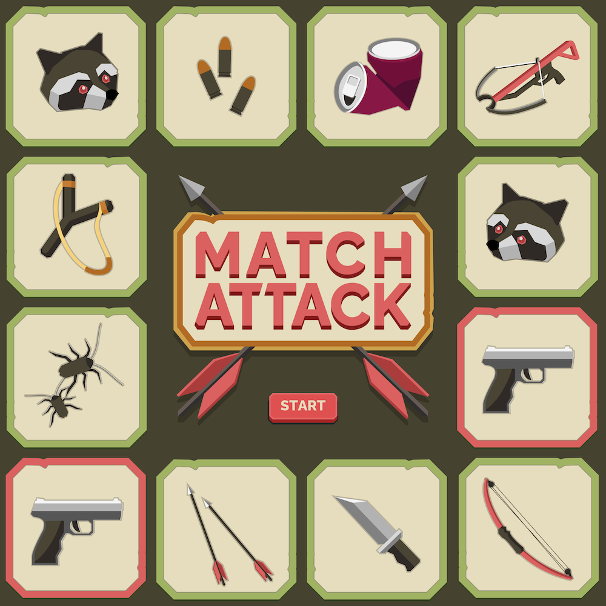

- [Play Game Online](https://scottdoxey.itch.io/match-attack)
- [GitHub](https://github.com/neogeek/match-attack-ggj-2021)

## [Card Against Undefined](https://cards-against-undefined.onrender.com/)

An online version of Cards Against Humanity with support for playing with expansions and custom decks.

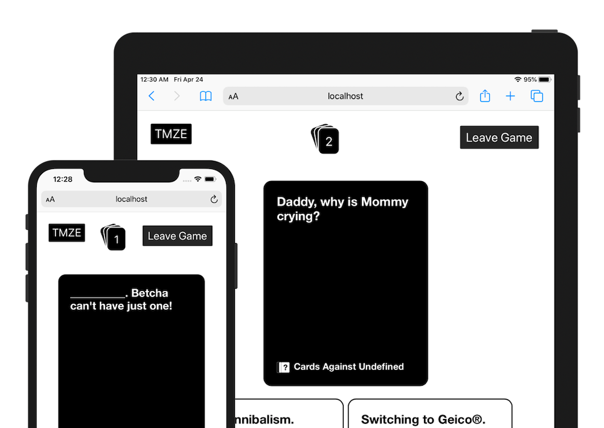

- [Play Game Online](https://cards-against-undefined.onrender.com/)
- [GitHub](https://github.com/neogeek/cards-against-undefined)

## [Smoothie Operator](https://scottdoxey.itch.io/smoothie-operator-unity-port)

Smoothie Operator is a Unity port of an HTML JavaScript canvas game made at the <a href="https://purplemonkeygamejam.com/">Purple Monkey Game Jam</a>.

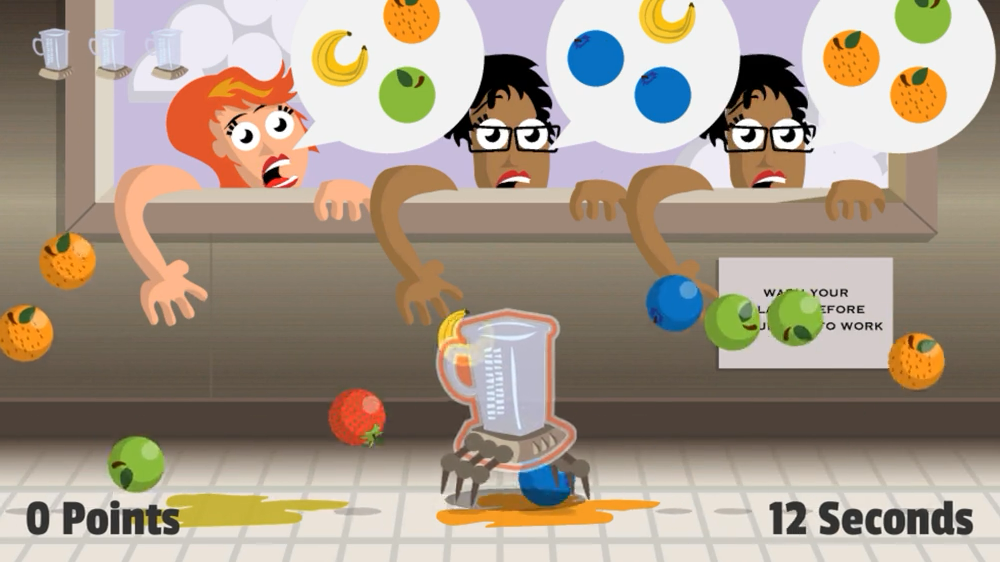

- [Play Game Online](https://scottdoxey.itch.io/smoothie-operator-unity-port)
- [GitHub](https://github.com/neogeek/Smoothie-Operator)

## [Top Down](https://topdown.app)

A simple, read-only, Trello board aggregator.

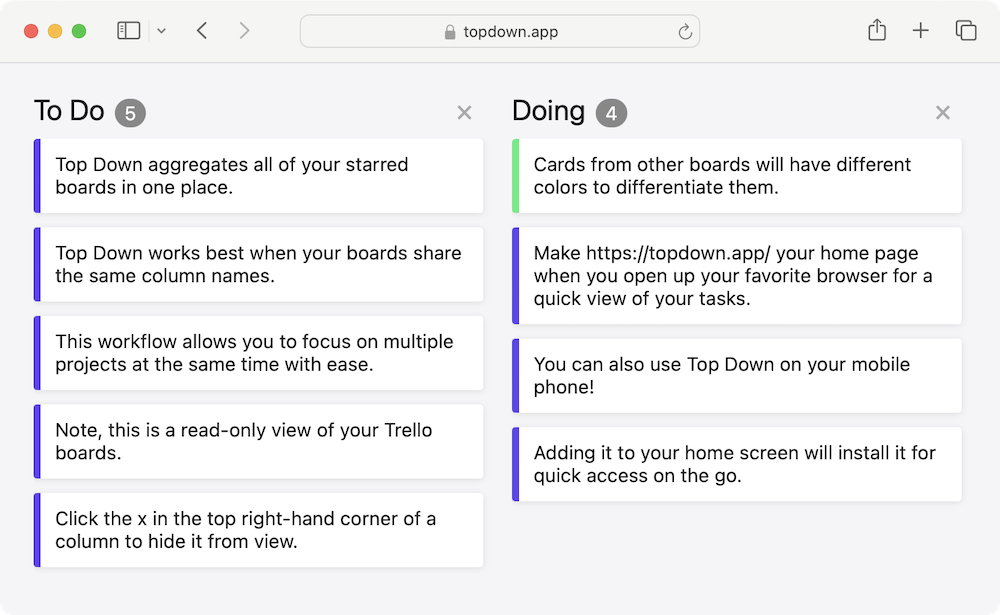

- [Try It Online](https://topdown.app)
- [GitHub](https://github.com/neogeek/topdown)

## [get-unity](https://github.com/neogeek/get-unity)

Command line tool for getting the download URL for the latest or specific version of Unity.

- [GitHub](https://github.com/neogeek/get-unity)

## [@neogeek/create-app](https://github.com/neogeek/create-app)

▲ A heavily opinionated starter template.

- [GitHub](https://github.com/neogeek/create-app)
